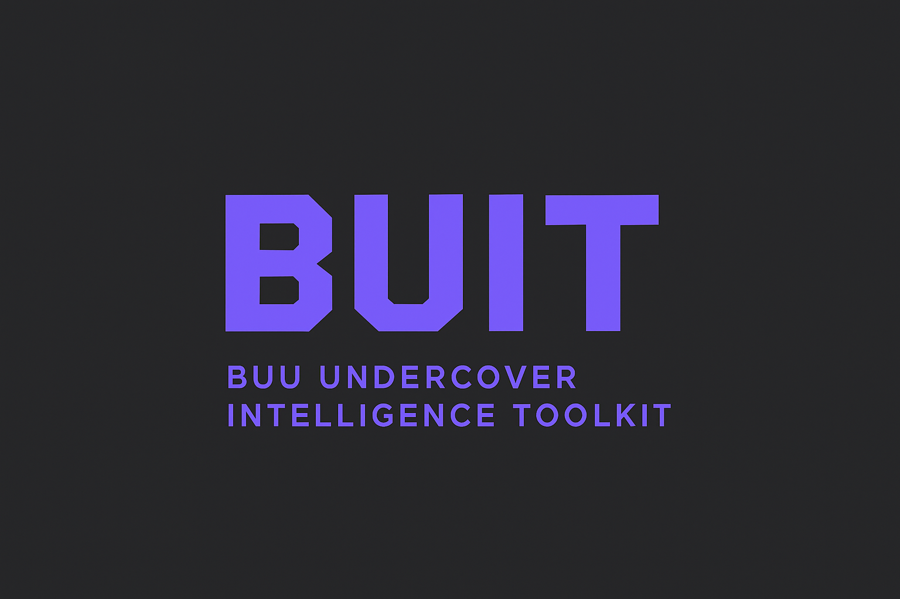

<div align="center">
  
</div>

<div align="center">

# 🔍 BUIT - Buu Undercover Intelligence Toolkit

**A blazingly fast OSINT framework built with Rust**

[](https://www.rust-lang.org/)
[](https://github.com/BuuDevOff/BUIT)
[](https://github.com/BuuDevOff/BUIT/releases)
[](LICENSE)

[](https://github.com/BuuDevOff/BUIT/releases)
[](https://github.com/BuuDevOff/BUIT/stargazers)
[](https://github.com/BuuDevOff/BUIT/network)

[📥 Download](#-quick-install) • [📖 Documentation](#-available-modules) • [🚀 Get Started](#-quick-start) • [💬 Community](#-contributing)

</div>

---

## ✨ What is BUIT?

**BUIT** is a comprehensive **Open Source Intelligence (OSINT)** toolkit designed for security professionals, researchers, and ethical hackers. Combine **20+ reconnaissance modules** into a single, lightning-fast command-line tool.

## 🚀 Quick Install

<div align="center">

**Choose your platform:**

[](#windows)
[](#macos--linux)  
[](#macos--linux)

</div>

### 🪟 Windows
```powershell
# Download and run - BUIT installs itself automatically!
Expand-Archive buit-v1.0.1-windows-x86_64-autosetup.zip
.\buit.exe --help
```

### 🍎 macOS / 🐧 Linux
```bash
# One-liner install with auto-setup
curl -L https://github.com/BuuDevOff/BUIT/releases/latest/download/buit-v1.0.1-macos-universal-autosetup.tar.gz | tar -xz
./buit --help
```

### 🛠️ Build from Source
```bash
# Install Rust if needed
curl --proto '=https' --tlsv1.2 -sSf https://sh.rustup.rs | sh

# Clone and build
git clone https://github.com/BuuDevOff/BUIT.git && cd BUIT
cargo build --release
```

## ⚡ Quick Start

<details>
<summary><strong>🎯 Common OSINT Tasks</strong></summary>

```bash
# 🔍 Username reconnaissance
buit username john_doe

# 📧 Email intelligence gathering
buit email target@example.com --breaches --social

# 🌐 Domain reconnaissance
buit domain example.com --dns --ssl --whois

# 📱 Phone number lookup
buit phone +1234567890 --carrier

# 🔐 Hash analysis
buit hash 5d41402abc4b2a76b9719d911017c592 --identify
```

</details>

<details>
<summary><strong>🔍 Advanced Reconnaissance</strong></summary>

```bash
# 🕷️ Subdomain enumeration
buit subdomain example.com --crt --brute

# 🌍 IP geolocation & analysis
buit ip 8.8.8.8 --geo --asn --reverse

# 🌐 Website technology stack
buit urlscan https://example.com --screenshot

# 📚 Wayback Machine lookup
buit wayback https://example.com --year 2020
```

</details>

💡 **Pro tip**: Use `buit <module> --help` for detailed options on any module!

## 🔧 Available Modules

<div align="center">

| 🔍 **Reconnaissance** | 🌐 **Web Intelligence** | 📱 **Social & Communications** |
|:---------------------|:------------------------|:-------------------------------|
| `username` - Social media username search | `domain` - Comprehensive domain analysis | `email` - Email breach & social lookup |
| `ip` - IP geolocation & ASN analysis | `urlscan` - URL technology scanning | `phone` - Phone number investigation |
| `subdomain` - Subdomain enumeration | `wayback` - Wayback Machine queries | `social` - Social media reconnaissance |
| `github` - GitHub profile analysis | `search` - Multi-engine searches | `leaks` - Data breach detection |

| 🛡️ **Security & Analysis** | 📊 **Data & Reporting** | ⚡ **Interactive Tools** |
|:---------------------------|:----------------------|:------------------------|
| `portscan` - Port discovery | `metadata` - File metadata extraction | `interactive` - Guided workflows |
| `hash` - Hash identification & cracking | `report` - Generate findings reports | `config` - Configuration management |
| `whois` - Domain registration lookup | `reverse-image` - Image reverse search | `setup` - Installation assistant |
| `shodan` - Device intelligence | `dork` - Google dorking | - |

</div>

## ⚙️ Configuration

<details>
<summary><strong>🔧 Performance Tuning</strong></summary>

```bash
# 🚀 Boost scanning speed with more threads
buit config set-threads 20

# 🌍 Route through proxy for anonymity
buit config set-proxy http://127.0.0.1:8080

# 🔍 Change user agent for better compatibility
buit config set-user-agent chrome
```

</details>

<details>
<summary><strong>🔑 API Keys & Integrations</strong></summary>

```bash
# 🛡️ Shodan API for device intelligence
buit config set-key shodan YOUR_SHODAN_API_KEY

# 🐙 GitHub API for enhanced repository analysis
buit config set-key github YOUR_GITHUB_TOKEN

# 📧 Hunter.io for email intelligence
buit config set-key hunter YOUR_HUNTER_API_KEY
```

</details>

```bash
# 📋 View current configuration
buit config list
```

## 🌟 Why Choose BUIT?

<div align="center">

| 🚀 **Performance** | 🛡️ **Reliability** | 🔧 **Flexibility** |
|:------------------|:------------------|:-------------------|
| ⚡ **Blazing Fast** - Rust-powered for maximum speed | 🔒 **Robust** - Enterprise-grade error handling | 🎯 **20+ Modules** - Complete OSINT toolkit |
| 🔄 **Multi-threaded** - Parallel processing capabilities | 🛠️ **Fallback Systems** - Never leaves you hanging | ⚙️ **Configurable** - Adapt to your workflow |
| 📊 **Optimized** - Memory efficient and resource-aware | 🔍 **Tested** - Battle-tested in real scenarios | 🌍 **Cross-platform** - Windows, macOS, Linux |

</div>

## 🤝 Contributing

<div align="center">

**Help make BUIT even better!**

[](https://github.com/BuuDevOff/BUIT/issues)
[](https://github.com/BuuDevOff/BUIT/pulls)

</div>

<details>
<summary><strong>🔧 Add New Modules</strong></summary>

Got an innovative OSINT technique? We want to see it!

```bash
# Check existing module structure
ls src/modules/

# Follow the established patterns
# - Async/await support
# - Error handling with anyhow::Result
# - Configurable output formats
# - Built-in help documentation
```

</details>

<details>
<summary><strong>🐛 Report Issues & Request Features</strong></summary>

- 🐛 **Found a bug?** Open an issue with reproduction steps
- 💡 **Feature idea?** Share your vision for new capabilities
- 📖 **Documentation?** Help improve our guides and examples
- 🧪 **Testing?** Help us test across different platforms

</details>

<details>
<summary><strong>🌟 Spread the Word</strong></summary>

Love BUIT? Help the community grow:

- ⭐ **Star this repository** - Show your support
- 🔄 **Share with colleagues** - Security professionals unite!
- 📢 **Social media mentions** - Tweet, post, discuss
- 💬 **Community forums** - Share in security communities

**Every star, share, and mention helps BUIT reach more security professionals!**

</details>

## ⚖️ Legal Notice

<div align="center">

**🛡️ Ethical Use Only**

This tool is designed for **authorized security testing** and **educational purposes** only.

Always ensure proper authorization before conducting reconnaissance activities.

**The developers assume no responsibility for misuse of this software.**

</div>

## 🚀 Roadmap - Coming Soon

<details>
<summary><strong>🎯 v1.1.0 - Discord Intelligence Module</strong></summary>

- **🎮 discord** - Advanced Discord OSINT capabilities
  - 🔍 User profile analysis via Discord ID
  - 🏰 Server/guild information gathering  
  - 🤖 Direct Discord API integration
  - 🖼️ Avatar/banner analysis (animated support)
  - 🏅 Badge detection (Staff, Partner, Bug Hunter, etc.)
  - ⏰ Account creation timestamp extraction
  - 🕸️ Relationship mapping and connections
  - 📊 Enhanced data vs third-party services
  - ⚡ Multi-token support for rate limits
  - 📚 Comprehensive setup documentation

</details>

## 📄 License

<div align="center">

[](LICENSE)

**MIT License** - see the [LICENSE](LICENSE) file for details

</div>

---

<div align="center">

**Built with ❤️ by [BuuDevOff](https://github.com/BuuDevOff)**

[](https://www.rust-lang.org/)
[](https://github.com/BuuDevOff/BUIT)

</div>